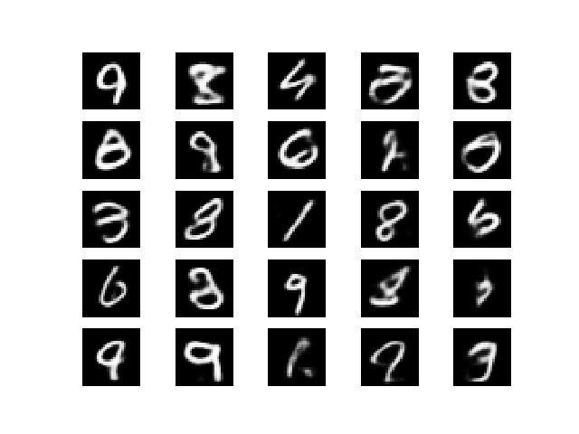
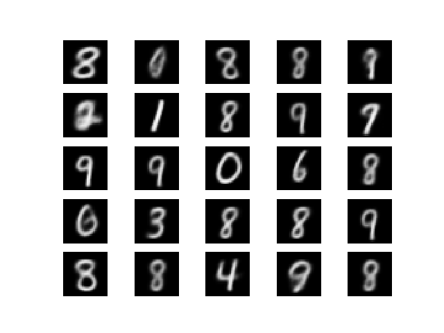
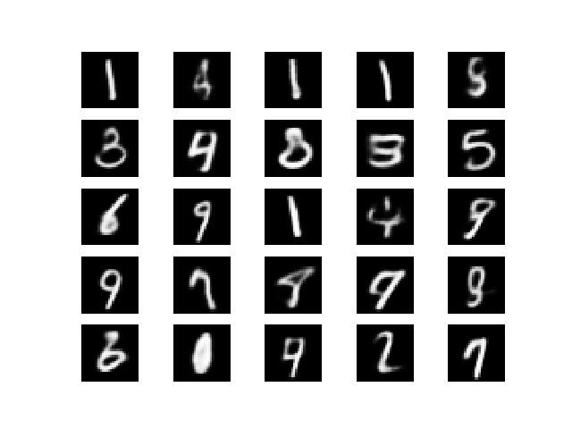

# Variational Autoencoders in Tensorflow

My implementation is based on [this tutorial](https://arxiv.org/abs/1606.05908) and 
[this open-source caffe code](https://github.com/cdoersch/vae_tutorial).

```
# fully-connected autoencoder on MNIST
python -m vae.scripts.vae_fc_mnist

# convolutional autoencoder on MNIST
python -m vae.scripts.vae_conv_mnist

# categorical convolutional autoencoder with Gumbel-Softmax on MNIST
python -m vae.scripts.sg_vae_conv_mnist
```

Samples from a fully-connected autoencoder:


Samples from a convolutional autoencoder:


Samples from a Gumbel-Softmax Categorical VAE:

Categorical KL divergence:



Relative KL divergence:



Straight-through:



