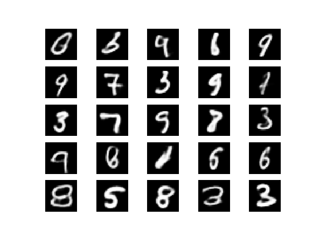
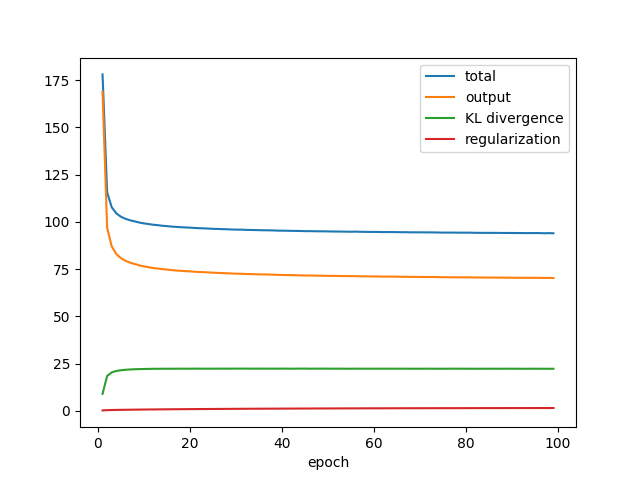

# Variational Autoencoders in Tensorflow




## Set up

* Install Python >= 3.6.
* Install packages in *requirements.txt*.

## Usage

###Autoencoder:
```
# ConvNet on MNIST
python -m vae.scripts.ae_conv_mnist
```

###Variational Autoencoder (VAE):

```
# ConvNet on MNIST
python -m vae.scripts.vae_conv_mnist

# fully-connected net on MNIST
python -m vae.scripts.vae_fc_mnist
```

Paper: https://arxiv.org/abs/1312.6114

MNIST, ConvNet, default settings: -71.52 test negative log-likelihood (1 run)

###VampPrior VAE:

```
# ConvNet on MNIST
python -m vae.scripts.vampprior_vae_conv

# fully-connected net on a toy dataset
python -m vae.scripts.vampprior_vae_fc_toy
```

Paper: https://arxiv.org/abs/1705.07120

MNIST, default settings: -70.08 test negative log-likelihood (1 run)

###Softmax-Gumbel VAE:

```
ConvNet on MNIST
python -m .vae.scripts.sg_vae_conv_mnist
```

Paper: https://arxiv.org/abs/1611.01144


## Notes

* The architecture of all ConvNets is based on this paper (https://arxiv.org/abs/1803.10122) with half the filters.
